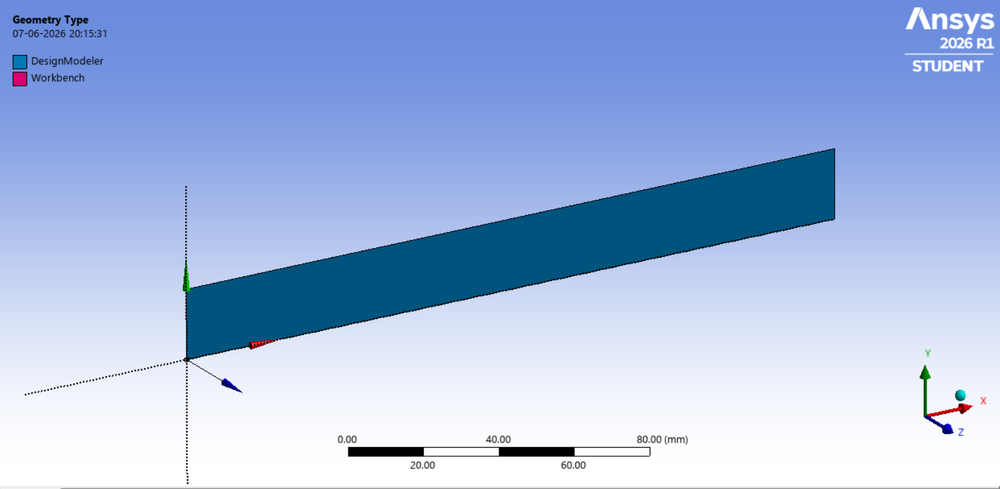
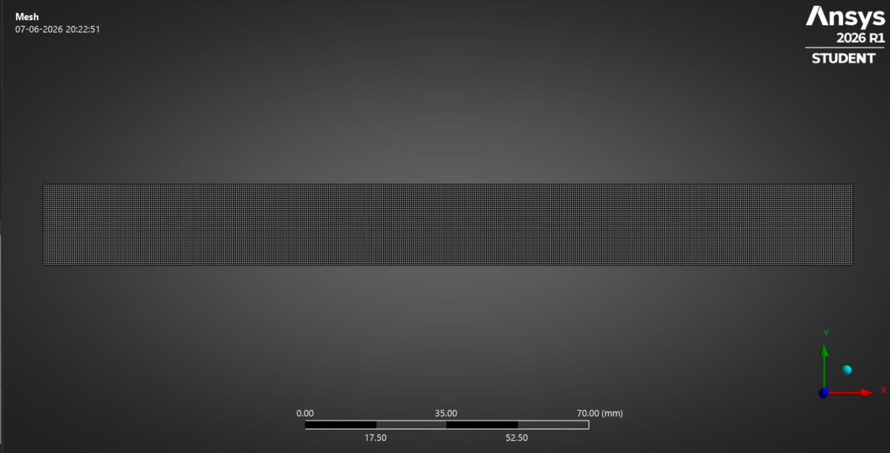

# 🌊 CFD Analysis of Laminar Flow through a Circular Pipe  | ANSYS Fluent

#### *A 2D Steady-State Laminar Internal Flow Simulation using ANSYS Fluent 2026 R1*

---

## 📖 Repository Overview

This repository presents a **2D steady-state Computational Fluid Dynamics (CFD)** simulation of **laminar flow through a circular pipe** performed using **ANSYS Fluent 2026 R1**.

The objective of this project is to investigate how viscous effects and wall shear influence the development of the velocity profile inside an internal flow domain. As fluid enters the pipe with a nearly uniform velocity distribution, the no-slip condition at the walls initiates boundary layer growth, gradually transforming the flow into a fully developed laminar profile.

Although laminar pipe flow is one of the most fundamental problems in fluid mechanics, it forms the basis for understanding momentum diffusion, pressure losses, and boundary layer development in internal flow systems.

This project serves as a foundational study in **internal flow analysis, viscous fluid behaviour, Reynolds number characterization, numerical simulation, and CFD post-processing using ANSYS Fluent.**

---

> **Engineering Focus**
>
> Understanding boundary layer growth, viscous effects, and velocity profile development in laminar internal flow using Computational Fluid Dynamics.

---

# 📑 Table of Contents

- [📖 Repository Overview](#-repository-overview)

- [🎯 Project Objectives](#-project-objectives)

- [🌊 Governing Physics](#-governing-physics)

- [🧩 Geometry Creation](#-geometry-creation)

- [🕸️ Mesh Generation](#️-mesh-generation)

- [⚙️ Solver Setup](#️-solver-setup)

- [📉 Solution & Convergence](#-solution--convergence)

- [📊 Results & Post-Processing](#-results--post-processing)

- [🧠 Engineering Discussion](#-engineering-discussion)

- [✅ Validation](#-validation)

- [💡 Key Learnings](#-key-learnings)

- [🚀 Future Improvements](#-future-improvements)

---

##  Repository Preview

---

# 🎯 Project Objectives

This project was undertaken to develop a numerical understanding of **steady-state laminar flow** through a circular pipe using Computational Fluid Dynamics (CFD). While analytical solutions accurately describe fully developed laminar flow, CFD provides deeper insight into how the flow evolves from the inlet, how boundary layers develop, and how viscosity influences the velocity distribution.

The primary objectives of this study are:

- Investigate the development of laminar flow inside a circular pipe at **Re = 100**.

- Visualize the evolution of the velocity profile along the pipe length.

- Study the influence of viscous effects and wall shear on boundary layer growth.

- Understand pressure variation and momentum transport in internal flows.

---

# 🌊 Governing Physics

The present analysis considers **steady-state, incompressible, Newtonian laminar flow** through a circular pipe.

The simulation is based on the following assumptions:

- Two-dimensional planar analysis
- Steady-state flow
- Incompressible fluid
- Newtonian fluid behaviour
- Laminar flow regime (Re = 100)
- Constant fluid properties
- No-slip wall condition

Under these assumptions, the flow behaviour is governed by the conservation of **mass** and **momentum**.

The simulation solves the **Continuity Equation** together with the **Navier–Stokes Equations**, allowing the development of the velocity field and pressure distribution to be predicted throughout the pipe.

As the solution converges, the flow gradually transitions from a nearly uniform inlet profile to a fully developed parabolic velocity profile due to viscous momentum diffusion and wall shear.

---

# 🧩 Geometry Creation

The computational model represents a **2D circular pipe fluid domain** developed to investigate steady-state laminar flow at **Reynolds Number 100**.

A two-dimensional planar geometry was selected to accurately capture the fundamental characteristics of internal flow while maintaining computational efficiency. The model enables visualization of velocity profile development, boundary layer growth, and pressure variation along the pipe length.

---

##  Geometry Specifications

| Parameter | Value |
|-----------|------:|
| Geometry Type | 2D Circular Pipe |
| Pipe Length | 0.20 m |
| Pipe Diameter | 0.02 m |
| Analysis Type | 2D Steady-State |

---

##  Geometry

> **Figure 1:** Computational geometry representing the 2D circular pipe used for laminar flow analysis.

---

# 🕸️ Mesh Generation

The computational domain was discretized using a **structured quadrilateral mesh** generated with the **Sweep Method** to accurately resolve the developing boundary layers and velocity gradients along the pipe walls.

A structured mesh provides improved numerical accuracy and lower discretization error, making it well suited for internal flow simulations.

---

##  Mesh Specifications

| Parameter | Value |
|-----------|------:|
| Mesh Type | Structured Quadrilateral |
| Number of Cells | 16000 |
| Number of Faces | 32440 |
| Number of Nodes | 16441 |
| Minimum Orthogonal Quality | 0.999 |
| Maximum Aspect Ratio | 1.44 |

---

##  Mesh

> **Figure 2:** Structured quadrilateral mesh generated for the computational domain.

---

#  Mesh Quality Assessment

The structured mesh provides a uniform element distribution throughout the pipe, enabling accurate prediction of boundary layer growth and velocity profile evolution while maintaining excellent numerical stability.

### Mesh Quality Evaluation

| Quality Metric | Assessment |
|----------------|-----------|
| Element Distribution | Uniform |
| Mesh Type | Structured |
| Numerical Accuracy | High |
| Solution Stability | Excellent |

The selected mesh ensures smooth convergence and reliable resolution of velocity gradients near the pipe wall, where viscous effects are most significant.

---

# ⚙️ Solver Setup

The simulation was performed using a **2D pressure-based steady-state solver** in **ANSYS Fluent 2026 R1** to investigate laminar flow development inside a circular pipe.

---

##  Solver Configuration

| Setting | Configuration |
|---------|---------------|
| Solver Type | Pressure-Based |
| Analysis | Steady-State |
| Space | 2D |
| Flow Model | Laminar |
| Pressure-Velocity Coupling | SIMPLE |

---

##  Material Properties

**Material:** Water

| Property | Value |
|---------|------:|
| Density | 998.2 kg/m³ |
| Dynamic Viscosity | 0.001003 Pa·s |

---

##  Boundary Conditions

The computational domain was configured to represent fully internal laminar flow through a circular pipe.

| Boundary | Condition |
|----------|-----------|
| Velocity Inlet | 0.005024 m/s |
| Pipe Wall | No-Slip Wall |
| Pressure Outlet | 0 Pa (Gauge) |

## Boundary Conditions

> **Figure 3:** Boundary conditions applied for the 2D Circular Pipe.

---

##  Reynolds Number & Inlet Velocity Calculation

The inlet velocity was calculated using the Reynolds Number relation to ensure laminar flow at **Re = 100**.

### Input Parameters

| Parameter | Value |
|----------|------:|
| Reynolds Number (Re) | 100 |
| Density (ρ) | 998.2 kg/m³ |
| Dynamic Viscosity (μ) | 0.001003 Pa·s |
| Pipe Diameter (D) | 0.02 m |

Using,

\[
Re=ρVD / μ \]

Rearranging,

\[
V= Re μ / ρ D \]

### Calculated Inlet Velocity

| Parameter | Value |
|----------|------:|
| Velocity (V) | **0.005024 m/s** |

This inlet velocity ensures that the flow remains within the **laminar regime (Re = 100)** throughout the simulation.

---

##  Numerical Methods

| Parameter | Method |
|-----------|--------|
| Pressure-Velocity Coupling | SIMPLE |
| Spatial Discretization | Second Order |

The SIMPLE algorithm provides stable pressure-velocity coupling, while second-order discretization improves numerical accuracy by reducing discretization errors.

---

# 📉 Convergence

The solution converged smoothly with stable residual behaviour.

### Convergence Summary

| Parameter | Status |
|-----------|--------|
| Residuals | Converged |
| Solution Stability | Stable |
| Flow Development | Successfully Achieved |

---

# 📊 Results & Discussion

The simulation successfully captured the hydrodynamic development of laminar flow through the circular pipe. The velocity and pressure contours clearly illustrated the influence of viscosity and wall friction on the evolving flow field.

---

## Results

> **Figure 4:** Velocity Magnitude contour showing the velocity Variation along the Pipe length.

 

> **Figure 5:** The above Graph Represents the Velocity Profile of laminar flow.

> **Figure 6:** Dynamic pressure distribution along the pipe.

 

> **Figure 7:** Total pressure variation throughout the computational domain.

---

## 🔍 Key Observations

- Velocity increased progressively toward the pipe centreline.
- Velocity reduced to zero at the walls due to the no-slip condition.
- Boundary layers developed from the inlet and gradually merged downstream.
- Pressure decreased continuously along the flow direction because of viscous friction.

---

# 🧠 Engineering Discussion

The simulation demonstrates the classical behaviour of **laminar internal flow**. As the fluid enters the pipe, wall friction slows the fluid adjacent to the walls, initiating boundary layer growth. These boundary layers continue to develop until they merge, producing the fully developed **parabolic velocity profile** predicted by fluid mechanics.

The numerical results closely match the expected physical behaviour, validating both the CFD setup and the governing flow physics.

---

# ✅ Validation

The numerical solution agrees with the theoretical characteristics of laminar pipe flow.

| Validation Parameter | Status |
|----------------------|--------|
| Laminar Flow Regime (Re = 100) | ✅ Verified |
| Velocity Profile Development | ✅ Verified |
| No-Slip Wall Behaviour | ✅ Verified |
| Pressure Drop Along Pipe | ✅ Verified |
| Numerical Stability | ✅ Stable |

---

# 💡 Key Learnings

- Application of CFD to internal laminar flow analysis.
- Development of hydrodynamic boundary layers.
- Influence of viscosity on momentum transport.
- Effect of wall friction on velocity and pressure distribution.

---

# 🚀 Future Improvements

Potential extensions of this project include:

- Mesh Independence Study
- Higher Reynolds Number Simulations
- Transition to Turbulent Flow
- Pipe Flow with Heat Transfer
- Three-Dimensional Pipe Analysis
- Flow Through Bends and Elbows

---

# 👨‍💻 Author

## Shrinivas

**Mechanical Engineer | Aspiring CFD Engineer**

Passionate about **Computational Fluid Dynamics (CFD), Fluid Mechanics, Heat Transfer, and Aerodynamics**, with a focus on developing simulation-driven engineering solutions using ANSYS Fluent.

### 🌐 Connect with Me

📫 **Email:** your.email@example.com

---

### ⭐ If you found this project useful, consider giving it a Star!

It motivates me to continue documenting and sharing my CFD learning journey.

**Let's connect and grow together in the field of Computational Fluid Dynamics. 🚀**

